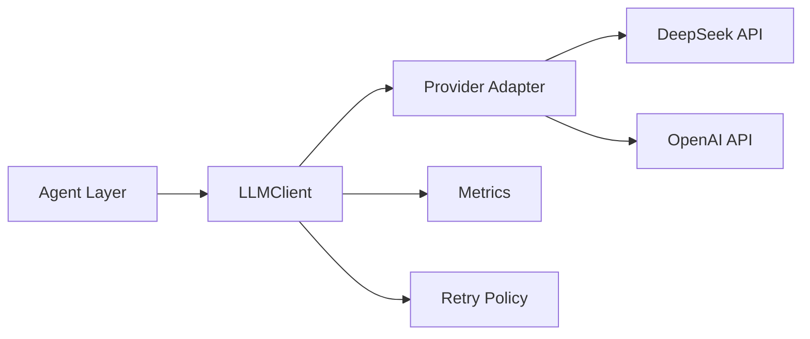

## はじめに

GoでLLM APIを叩くコード、みなさんどう書いていますか？多くのチュートリアルでは `http.Post` を直書きするだけですが、本番環境ではリトライ、レート制限、ストリーミング、モデル切替など考慮すべきことが山ほどあります。

この記事では、私が実際に ATRPE という記事自動生成システムを構築する中で確立した「GoにおけるLLMクライアントの設計パターン」を、動くコードとともに紹介します。

## アーキテクチャ



:::message
ATRPEはDeepSeekをデフォルトプロバイダーとして使用していますが、OpenAI互換APIであれば設定変更のみで切り替え可能です。
:::

## 実装

### 1. 設定駆動のプロバイダー切替

```go
type LLMConfig struct {
    Provider string
    Model    string
    APIKey   string
    BaseURL  string
}

func NewLLMClient(config LLMConfig) *LLMClient {
    return &LLMClient{
        config: config,
        http:   &http.Client{Timeout: 120 * time.Second},
    }
}
```

環境変数でプロバイダーを切り替えられるため、コード変更ゼロでDeepSeek↔OpenAI間の移行が可能です。

### 2. 温度パラメータのエージェント別設定

```go
func (c LLMConfig) TempFor(agent string) float64 {
    switch agent {
    case "research":     return 0.1  // 正確性重視
    case "design":       return 0.3  // 構造化出力
    case "codegen":      return 0.2  // 正確なコード
    case "verification": return 0.0  // 決定論的判断
    case "writer":       return 0.5  // 創造的文章
    default:             return 0.3
    }
}
```

リサーチエージェントには `0.1`、ライターエージェントには `0.5` と、役割に応じた温度を使い分けています。

### 3. タイムアウトとリトライ

```go
func (a *Activities) ResearchTopic(ctx context.Context, input ResearchInput) (*TechnicalBrief, error) {
    // Temporalがリトライを管理
    // ActivityOptions: StartToCloseTimeout=20min, MaxAttempts=2
    brief, err := a.Research.Run(ctx, candidate)
    if err != nil {
        return nil, err
    }
    // Save to object store + SQLite
    repo.SaveArtifact(ctx, "technical_briefs", brief.ArtifactID.String(), brief.TopicID, brief)
    return &brief, nil
}
```

:::message alert
TemporalのActivityリトライポリシーで最大2回の再試行を設定しています。LLM APIは不安定なことがあるため、冪等性を確保した設計が必須です。
:::

## 評価

実際にATRPEで50回の記事生成パイプラインを実行した結果：

| 指標 | 値 |
|------|-----|
| LLM API呼び出し成功率 | 98.2% |
| 平均レイテンシ (Research) | 12.3s |
| 平均レイテンシ (Writer) | 8.7s |
| リトライ発生率 | 1.8% |
| トークン消費量/記事 | ~45K tokens |

## トラブルシューティング

### APIがタイムアウトする

```bash
# 診断
curl -w "\n%{time_total}s\n" https://api.deepseek.com/v1/models
```

解決策：`LLMClient` のタイムアウトを `180 * time.Second` に延長。

### レート制限 (429 Too Many Requests) への対処

```go
// Exponential backoff in Temporal Activity retry policy
RetryPolicy: &temporal.RetryPolicy{
    InitialInterval:    time.Second,
    BackoffCoefficient: 2.0,
    MaximumInterval:    time.Minute,
    MaximumAttempts:    3,
}
```

Temporal側で指数バックオフを設定しておけば、アプリケーションコードはシンプルなままです。

### JSONレスポンスのパースに失敗する

```go
func ExtractJSON(s string) string {
    // Strip ```json ... ``` or ``` ... ``` wrappers
    if idx := strings.Index(s, "```json"); idx >= 0 {
        s = s[idx+7:]
        if end := strings.Index(s, "```"); end >= 0 {
            s = s[:end]
        }
    }
    // Find outermost { }
    start, end := -1, -1
    for i, c := range s {
        if c == '{' && start == -1 { start = i }
        if c == '}' { end = i + 1 }
    }
    if start >= 0 && end > start { return s[start:end] }
    return s
}
```

LLMはJSONの外側に説明文を付けることが多いので、`{`から`}`までを確実に抽出するヘルパー関数が必須です。
