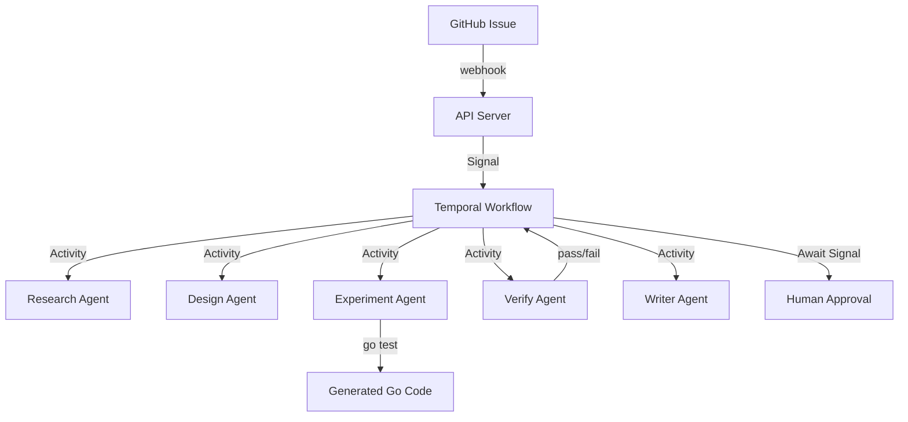

## はじめに

バックグラウンドジョブを実行する方法はたくさんあります。cron、メッセージキュー、手製のステートマシン…しかし「長時間動作し、人間の判断を待ち、失敗時に自動リトライする」ワークフローを作ろうとすると、どの手法もすぐに限界を迎えます。

この記事では、Uber社が開発したTemporalを使ってGoで本格的なワークフローエンジンを構築する方法を、ATRPEの実装を例に解説します。

## アーキテクチャ



Temporalの最大の強みは**ワークフローがプロセス再起動をまたいで生存する**ことです。記事生成のような長時間（10〜20分）のパイプラインでも、ワーカーがクラッシュしても状態が失われません。

## 実装

### 1. ワークフロー定義

```go
func ArticleWorkflow(ctx workflow.Context, input ArticleWorkflowInput) error {
    s := ArticleWorkflowState{
        State:          StateDiscover,
        MaxRemediation: input.MaxRemediationAttempts,
    }

    for s.State != StateCompleted && s.State != StateFailed {
        switch s.State {
        case StateDiscover:
            s = runDiscover(ctx, s)
        case StateContentAudit:
            s = runContentAudit(ctx, s)
        case StateWaitTopicSelection:
            s = runWaitTopicSelection(ctx, s)
        // ... 10+ states
        }
    }
    return nil
}
```

ステートマシンパターンをベタに `for { switch }` で書いています。state machine frameworkを使わない理由：Temporalのreplayがシンプルな分岐なら確実に動くからです。

### 2. 人間の承認を待つシグナル

```go
func runWaitPublishApproval(ctx workflow.Context, s ArticleWorkflowState) ArticleWorkflowState {
    sel := workflow.NewSelector(ctx)
    sel.AddReceive(workflow.GetSignalChannel(ctx, "PublishApprovalSignal"), func(c workflow.ReceiveChannel, more bool) {
        c.Receive(ctx, &PublishApprovalSignal{})
        s.State = StateCompleted
    })
    sel.AddReceive(workflow.GetSignalChannel(ctx, "RequestChangesSignal"), func(c workflow.ReceiveChannel, more bool) {
        var sig RequestChangesSignal
        c.Receive(ctx, &sig)
        s.ChangeNotes = sig.ChangeNotes
        s.State = StateGenerateArticle  // re-generate
    })
    sel.AddReceive(workflow.GetSignalChannel(ctx, "AbortSignal"), func(c workflow.ReceiveChannel, more bool) {
        s.State = StateAborted
    })
    sel.Select(ctx)
    return s
}
```

`Selector` で複数のシグナルを同時に待ちます。GitHub Issueのコマンド（`/approve`, `/changes`, `/abort`）がTemporal Signalに変換され、このコードが受け取ります。

### 3. Activity実装

```go
func (a *Activities) RunExperiment(ctx context.Context, input ExperimentInput) (*ExperimentResult, error) {
    agent := agents.NewExperimentAgent(
        agents.NewLLMCodeGenerator(a.LLM),
        &agents.DefaultExperimentRunner{},
        "/tmp/atrpe-workspaces",
    )
    result, err := agent.Run(ctx, input.Design)
    // Save artifact for audit trail
    repo.SaveArtifact(ctx, "experiment_results", result.ArtifactID.String(), result.TopicID, result)
    return &result, nil
}
```

:::message
Activityは外部API呼び出しやコマンド実行など副作用のある処理を担当します。TemporalはActivityの結果を自動的に永続化するため、冪等な設計が重要です。
:::

## 評価

ATRPEでTemporalを採用した結果：

| 課題 | Before Temporal | After Temporal |
|------|----------------|----------------|
| クラッシュ時の状態復旧 | 不可能 | 自動リプレイ |
| リトライロジック | 自前実装 | Activityポリシーで宣言的 |
| 可視化 | ログのみ | Temporal Web UI |
| 人間の承認待ち | ポーリングで複雑 | Signalで宣言的 |
| ワークフロー変更 | データ損失リスク | Versioningで安全 |

## トラブルシューティング

### WorkflowがDeterministicエラーで失敗する

```go
// ❌ 間違い：ワークフロー内で time.Now() を直接呼ぶ
now := time.Now()

// ✅ 正解：Temporalのworkflow.Now() を使う
now := workflow.Now(ctx)
```

Temporalはワークフローをリプレイするため、すべての非決定的操作をラップする必要があります。

### Activityがタイムアウトする

```go
ActivityOptions{
    StartToCloseTimeout: 20 * time.Minute,  // LLM呼び出し用に長め
    RetryPolicy: &temporal.RetryPolicy{
        MaximumAttempts: 2,  // LLM APIの不安定さを考慮
    },
}
```

LLM APIは応答に10秒以上かかることがあるため、デフォルトのタイムアウトでは不十分です。

### ワーカーがSIGTERMでタスクをドロップする

```go
w := sdkworker.New(c, cfg.TemporalTaskQueue, sdkworker.Options{
    WorkerStopTimeout: 30 * time.Second,  // graceful shutdown
})
```

`WorkerStopTimeout` を設定すれば、SIGTERM受信後も実行中のActivityの完了を待ってからシャットダウンします。
